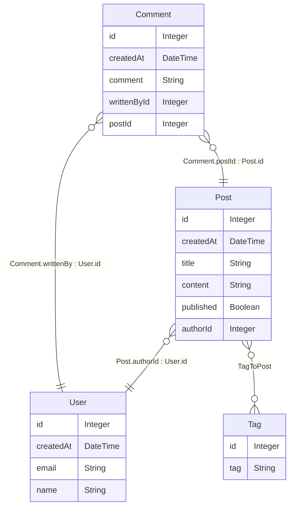

# Prisma schema

```mermaid
erDiagram

User {
    id Integer
    createdAt DateTime
    email String
    name String
}

Post {
    id Integer
    createdAt DateTime
    title String
    content String
    published Boolean
    authorId Integer
}

Comment {
    id Integer
    createdAt DateTime
    comment String
    writtenById Integer
    postId Integer
}

Tag {
    id Integer
    tag String
}

Post }o--|| User : "Post.authorId : User.id"
Comment }o--|| User : "Comment.writtenBy : User.id"
Comment }o--|| Post : "Comment.postId : Post.id"
Post }o--o{ Tag : "TagToPost"
```