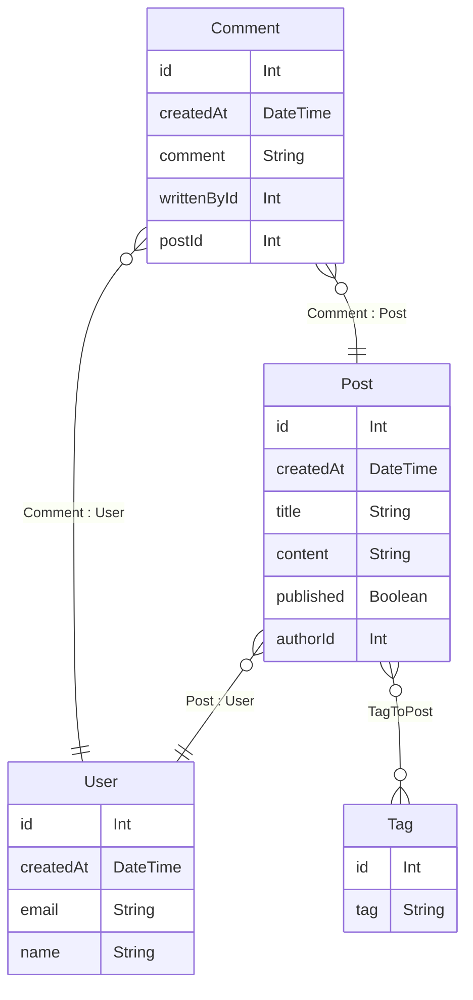

# Prisma schema

```mermaid
erDiagram

User {
    id Int
    createdAt DateTime
    email String
    name String
}

Post {
    id Int
    createdAt DateTime
    title String
    content String
    published Boolean
    authorId Int
}

Comment {
    id Int
    createdAt DateTime
    comment String
    writtenById Int
    postId Int
}

Tag {
    id Int
    tag String
}

Post }o--|| User : "Post : User"
Comment }o--|| User : "Comment : User"
Comment }o--|| Post : "Comment : Post"
Post }o--o{ Tag : "TagToPost"
```